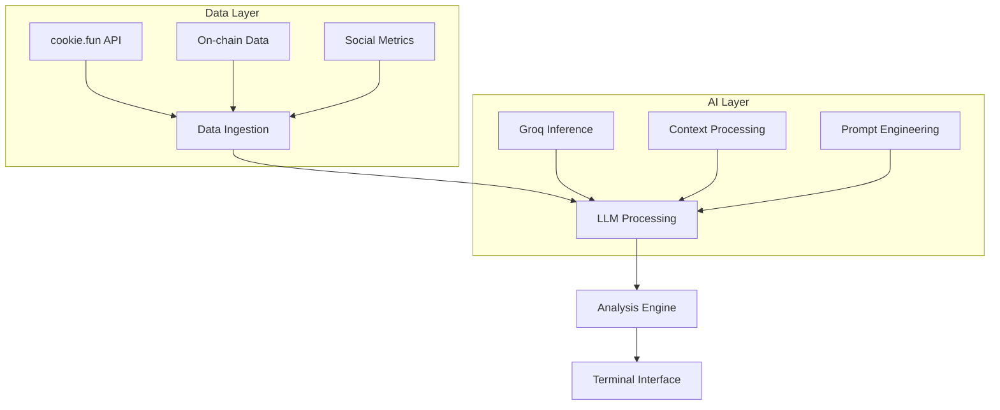

# 🧠 LIQUBIT (NO TOKEN YET)


> Advancing on-chain intelligence through LLM-powered market analysis
>

## STATUS
1) MVP for terminal product is developed with in context crypto data context -> LLM processing layer
2) Cookie.fun integration in process (REQUEST TO DAO OUT); Data swarms to track mindshare and other analytics to be a core functionality
3) No token yet. Much work to be done enhancing data layer. The MVP is capable of processing LLM chat completions with llama-3.3-70b-versatile
4) Socials presence in process
5) No compute or paid API investments. Bootstrapped. Currently not deployed.

## 🎯 Mission
LIQUBIT combines state-of-the-art language models with real-time on-chain analytics to create a sophisticated market intelligence protocol. By leveraging the LLaMA-3.3-70B model through Groq inference, we're pushing the boundaries of what's possible in AI crypto market analysis.

## 🔬 Technical Overview

### Core Components



### Key Technologies

- **LLM Integration**: LLaMA-3.3-70B with Groq inference
- **Data Sources**:
  - cookie.fun for AI agent analytics
  - Native RPC nodes for on-chain data
  - Social sentiment via X API
- **Networks**: Solana & Base
- **Processing**: Real-time data correlation and analysis

## 🛠 Development Stack

### AI/ML Pipeline
```python
from transformers import LlamaTokenizer, LlamaForCausalInference
import groq

# Example of our inference pipeline
class LiqubitInference:
    def __init__(self):
        self.tokenizer = LlamaTokenizer.from_pretrained("liqubit/llama-3.3-70b")
        self.client = groq.Client()
    
    async def process_market_data(self, context):
        # Implementation details in docs/inference.md
        pass
```

### Data Integration
```typescript
interface DataSource {
  fetchMarketData(): Promise<MarketData>;
  fetchOnChainMetrics(): Promise<ChainMetrics>;
  fetchSocialSentiment(): Promise<SentimentData>;
}
```

### Analysis Engine
```python
class MarketAnalysis:
    def __init__(self, model: LiqubitInference):
        self.model = model
        self.metrics = MetricsAggregator()
    
    async def analyze_token(self, token: str) -> Analysis:
        # Implementation details in docs/analysis.md
        pass
```

## 🔄 Current Focus Areas

1. **LLM Optimization**
   - Prompt engineering for market analysis
   - Context window optimization
   - Response latency reduction

2. **Data Integration**
   - Real-time data pipeline optimization
   - Cross-chain data correlation
   - Social sentiment analysis improvements

3. **Analysis Capabilities**
   - Advanced pattern recognition
   - Risk assessment models
   - Predictive analytics

## 🤝 Contributing

We're actively seeking contributors with expertise in:

- **Large Language Models**
  - Prompt engineering
  - Model fine-tuning
  - Inference optimization

- **Market Analysis**
  - Technical analysis
  - On-chain analytics
  - Sentiment analysis

- **Development**
  - Solana/Base development
  - High-performance TypeScript
  - Python ML/Data pipelines

### Getting Started

1. **Development Environment**
```bash
git clone https://github.com/liqubit/liqubit-core.git
cd liqubit-core
python -m venv venv
source venv/bin/activate
pip install -r requirements.txt
npm install
```

2. **Running Tests**
```bash
pytest tests/
npm test
```

3. **Local Development**
```bash
# Start development environment
npm run dev

# Run AI pipeline locally
python scripts/run_pipeline.py
```


## 🔗 Resources

- [Technical Documentation](https://docs.liqubit.xyz)
- [API Reference](https://docs.liqubit.xyz/api)
- [Architecture Overview](https://docs.liqubit.xyz/architecture)
- [Contributing Guide](https://docs.liqubit.xyz/contributing)


## 📈 Roadmap Q1 2024

- [ ] LLaMA model fine-tuning for market analysis
- [ ] Advanced on-chain analytics integration
- [ ] Cross-chain correlation engine
- [ ] Automated trading module beta

## 🤖 Join the Development

We're building the future of on-chain intelligence. If you're passionate about:
- Large Language Models
- Blockchain
- AI Agents
- Market Analysis
- High-Performance Computing

We want to work with you. Reach out:
- [Discord](https://discord.gg/liqubit-dev)
- [GitHub Issues](https://github.com/liqubit/liqubit-core/issues)

## 📜 License

MIT License - see [LICENSE](LICENSE) for details

